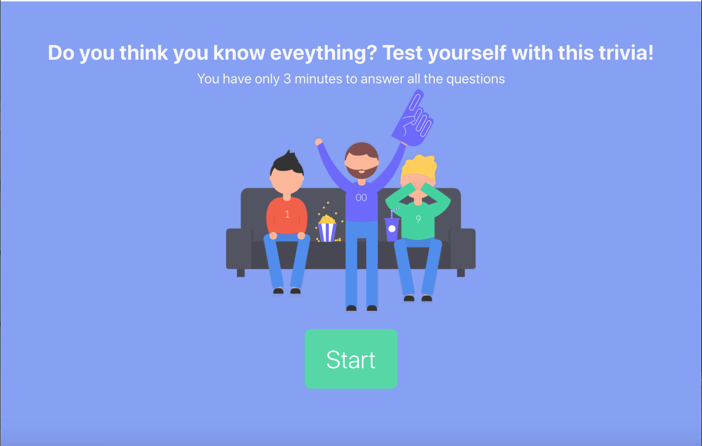
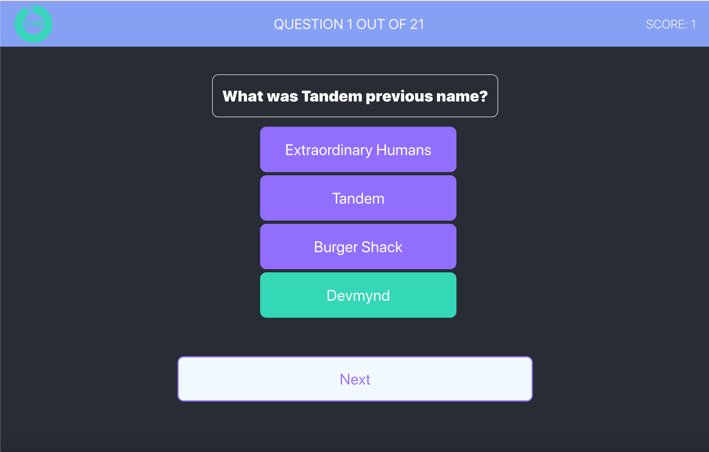
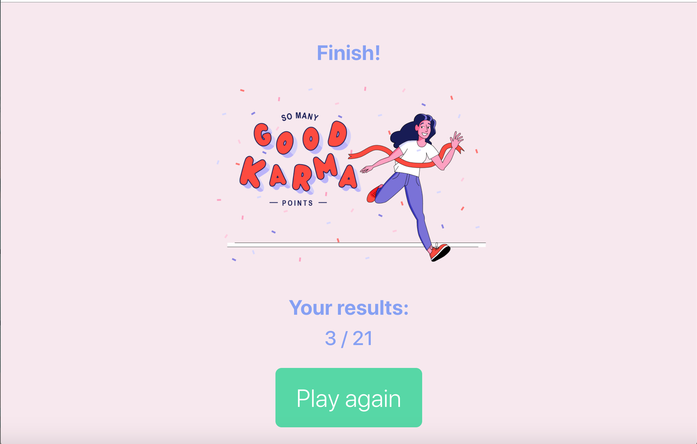

# React Trivia App 

You can see this app in action here: https://react-trivia-app-tandem.herokuapp.com/. 
Have fun!

## How to use this app

In the project directory, you can run:

### `npm start`

Runs the app in the development mode.\
Open [http://localhost:3000](http://localhost:3000) to view it in the browser.

## Additional features that I would love to add:

Unfortunately, I didnt have a lot of time to add all features that I wanted but I had a lot of fun in the process! I know that this small app needs a lot of refactoring and here are only the few things I would add/change:

- Add more tests
- Use Redux or Context API to manage state
- Connect a database, add data persistence
- Add game history
- Allow a user to enter a name when starting a game
- Add more statistics
- Add a menu
- right now, users are able to skip the questions. Ideally, I woudn't allow it and would check if the person answered before going to the next question.
- display a different message on the final page depending on the score
- I love designing apps so I would spend more time to make it pretty

## Screenshots

#### Start

#### Trivia

#### Results

